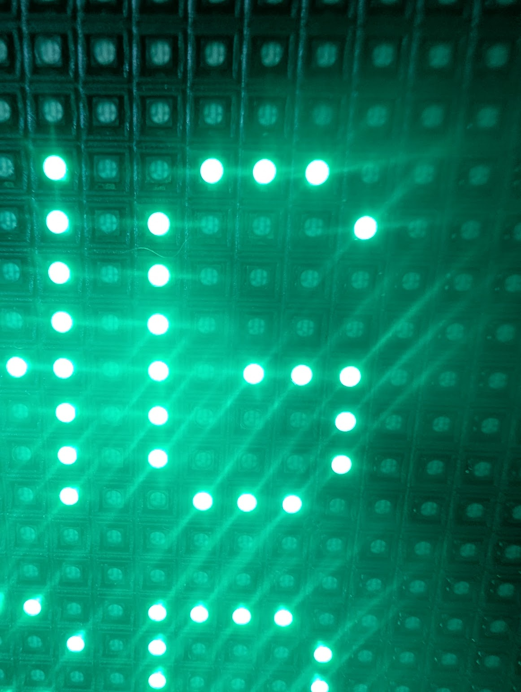

# LED Matrix Portal Camera Feed

Real-time high-performance camera feed displayed on a 64x32 RGB LED matrix.



*Up close on the 64×32 Adafruit Matrix Portal display (raw, no diffuser). More hardware photos in [`docs/`](docs/).*

> 🤖 **Built as an agentic-coding experiment** — written primarily through prompts and configuration, with an AI agent doing the coding. See [How this project was built](docs/how-this-was-built.md).

## System Overview

```
Camera → Computer (Pi, Mac, PC) → USB Serial (4M baud) → Matrix Portal M4 → LED Matrix
```

- **Render Speed**: **~24 FPS** (Optimized from 5 FPS)
- **Tech Stack**: Python 3.14+, CircuitPython 10, Optimized `bitmaptools`
- **Resolution**: 64x32 pixels, RGB565 color

## Project Versions

| Folder | Name | Description |
|--------|------|-------------|
| **`pro/`** | **Professional** | Modular, production-ready Python application. Uses `uv`, strict typing, and advanced config. |
| **`hs/`** | **High School** | Educational, single-folder version (`hs/src`) for students. Simplified code, cross-platform. |
| **`matrix-portal/`**| **Firmware** | CircuitPython apps for the Adafruit Matrix Portal M4 — see [Matrix Portal Demos](#matrix-portal-demos) below. |
| **`utils/`** | **Utilities** | `ledportal-utils` library for snapshot export (PNG, blocks, circles). |
| **`macropad/`** | **MacroPad Remote** | CircuitPython macro pages for the Adafruit MacroPad RP2040. Physical button controller for all camera feed commands. |

### Matrix Portal Demos

The on-device CircuitPython apps in `matrix-portal/`, selected from the boot **hub** screen using the onboard UP / DOWN buttons:

| Demo | Hub selection | Description |
|------|---------------|-------------|
| **Camera Mirror** | `MIRROR` (default) | Displays the live USB camera feed streamed from the host `ledportal` app. |
| **Photo Slideshow** | `UP → PHOTOS` | Cycles built-in images stored on the device (`dog.png`, `kitten.png`, …). |
| **Silly Bird** | `DOWN → BIRD` | A silly bird fly through gates game, playable in portrait or landscape. |

See [`matrix-portal/README.md`](matrix-portal/README.md) for deployment and [`matrix-portal/NAVIGATION.md`](matrix-portal/NAVIGATION.md) for the full screen-flow diagram.

## Raspberry Pi Workflows

### For Pro Version
**Best:** VS Code Remote SSH - develop on Mac, run on Pi hardware
```bash
# In VS Code: CMD+Shift+P → "Remote-SSH: Connect to Host"
# See pro/README.md for full setup
```

**Alternative:** Git clone + uv on Pi
```bash
git clone <repo>
cd pro
uv sync
uv run ledportal
```

### For HS Version (Educational)
**Simplest:** get the code, then let `uv` handle Python + dependencies in one command:
```bash
git clone https://github.com/deangoodmanson/MatrixPortalDemos.git
cd MatrixPortalDemos/hs
uv run python src/camera_feed.py   # uv installs Python 3.14 + all deps on first run
```

**Getting the code without `git`:** download the repo ZIP from GitHub
(**Code → Download ZIP**), unzip, then run the same `cd hs && uv run …`. For a
classroom, a teacher can distribute the `hs/` folder over a shared network drive
(SMB/NFS), cloud folder, or USB stick — each student just needs the `hs/` folder
(it includes `pyproject.toml`, so `uv` knows what to install).

See `hs/README.md` and `pro/README.md` for detailed workflows.

## Quick Start

No LED matrix or Matrix Portal hardware is required to develop or run the software.
The app works with just a webcam — use the preview window (`w`) to see the LED
simulation on screen. The `--no-display` flag skips serial port detection entirely.

### 1. Run the Camera Feed
You have two options:

#### Option A: Professional (Recommended)
Fast, configurable, and robust.
```bash
cd pro
uv sync
uv run ledportal
```

#### Option B: Educational (Simple)
Great for learning how it works.
```bash
cd hs
uv run python src/camera_feed.py   # uv reads hs/pyproject.toml — no manual venv or pip
```

### 2. Setup Matrix Portal M4 (optional)
To display on a physical LED matrix:
1. Install CircuitPython 10.0.3+ on your Matrix Portal M4.
2. Install required library: `circup install adafruit_display_text`
3. Copy `matrix-portal/code.py` to your `CIRCUITPY` drive.
4. Additional libraries needed in `lib/`: `adafruit_display_text`, `adafruit_matrixportal`.

## Features
*   **Auto-Detection**: Code automatically finds the Matrix Portal USB device.
*   **Cross-Platform**: Works on macOS, Linux, Raspberry Pi, and Windows.
*   **Orientation**: `l` landscape (default) · `p` portrait
*   **Processing**: `c` center crop (default) · `s` stretch · `f` fit (letterbox)
*   **Effects**: `b` B&W toggle · `m` mirror · `z` zoom (100→75→50→25%) · `o` render algorithm · `+`/`-` LED size
*   **Actions**: `Space` snapshot (with PDF export) · `v` avatar capture
*   **Demo**: `x` auto demo · `Shift+X` manual demo · `.`/`,` next/prev step
*   **Preview**: `w` toggle preview window with camera + LED side-by-side
*   **System**: `t` toggle transmission · `d` debug · `r` reset · `h` help · `q` quit

## For Educators & Learners

This project is built for teaching Python and physical computing, with two
learning on-ramps and no hardware required to start (a webcam + the preview
window is enough):

- **[High School edition](hs/README.md)** — single-file, heavily commented, with
  a Learning Path, Key Concepts, and hands-on Exercises.
- **[Learning with AI](docs/learning-with-ai.md)** — using Claude Desktop / Claude
  Code as a *tutor* (not an answer key), for both teachers and students.
- **[How this project was built](docs/how-this-was-built.md)** — the agentic-coding
  story, and a concrete answer to *"if AI can code, why learn to code?"*
- **[Why learn Python if AI generated this?](docs/why-learn-to-code.md)** — the
  project's own take on responsible AI use in learning.

## Performance Optimizations
We achieved a ~500% performance increase (5 FPS → 24 FPS) by:
1.  **Firmware**: Replaced Python pixel loops with `bitmaptools.arrayblit` (C-level memory copy).
2.  **Transport**: Increased USB Serial baud rate to **4,000,000**.
3.  **Pipeline**: Optimized frame resizing and RGB565 conversion in Python.

## Diagnostics

### RGB565 color artifact comparison

If the physical LED matrix shows color artifacts (wrong-colored pixels) that
do not appear in the software BMP snapshot, use the comparison script to
investigate:

```bash
uv run --project pro python docs/compare_rgb565.py [pro/snapshot_*.bmp]
```

This produces a side-by-side 10× PNG (saved next to the BMP):

| Panel | Content |
|-------|---------|
| Left  | Original BMP — what the software saved / preview shows |
| Centre | After RGB565 roundtrip — what the matrix actually receives |
| Right | \|difference\| × 4 — artifact map |

The script also prints per-pixel and per-channel shift statistics.  A max
shift of ≤7 counts rules out RGB565 quantization as the cause.

See `docs/compare_rgb565.py` for the full methodology, RGB565 bit-layout
reference, and a guide to distinguishing rolling-shutter artifacts, camera
bloom, hardware LED variation, and serial bit flips.

## Troubleshooting

**"Matrix Portal not found"**
*   Check your USB cable (some are power-only!).
*   Ensure `code.py` is running on the device (screen should say "WAITING FOR USB").

**"Permission denied" (Linux/Pi)**
*   You may need to add your user to the `dialout` group: `sudo usermod -a -G dialout $USER`.
