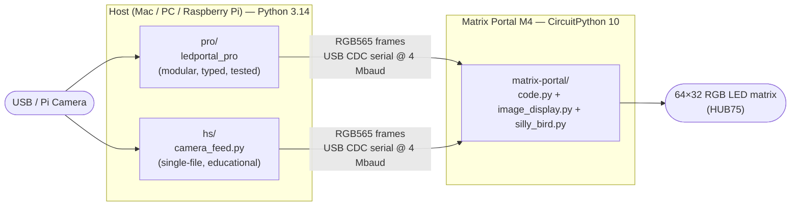
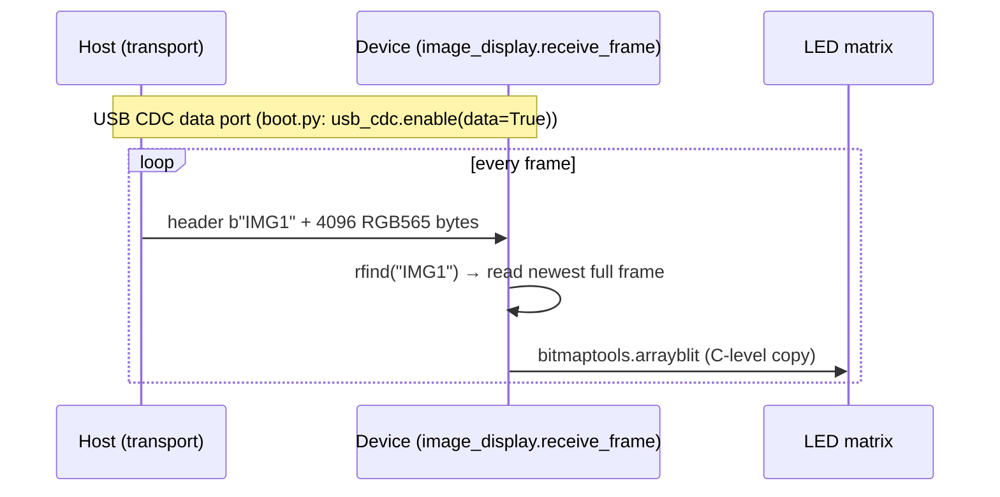
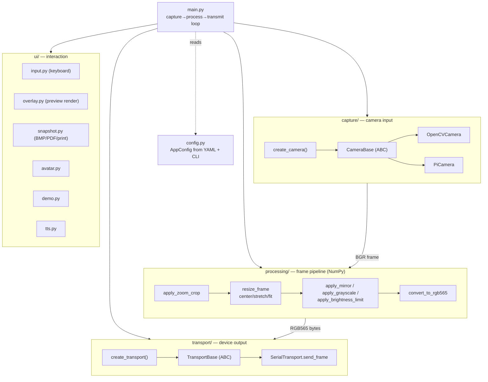
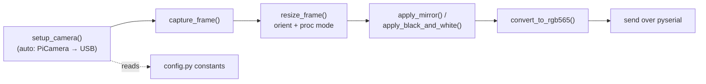
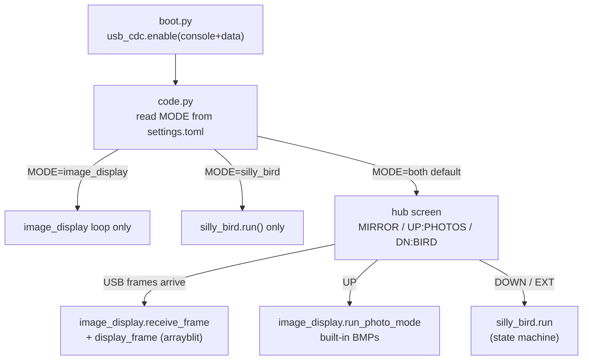

# Architecture

A map of the three applications in this repository and how they fit together.
Written to give a human — or an AI coding agent — enough of the shape to make a
change in the right place without reading every file first.

The diagrams below use [Mermaid](https://mermaid.js.org/), which GitHub renders
natively. Symbol names (`create_camera`, `receive_frame`, etc.) match the actual
code so you can jump straight from a box to a function.

> **Resolution note:** the matrix is **64×32** (landscape). Portrait mode is the
> same panel rotated 90° (a 32×64 logical plane). Frames are **RGB565**
> (2 bytes/pixel = 4096 bytes/frame) sent over **USB CDC serial at 4 Mbaud**.

---

## 1. System overview — three apps, one pipeline

Two of the apps are **host-side** Python (run on a Mac/PC/Pi); one is
**device-side** CircuitPython firmware (runs on the Matrix Portal M4). The host
captures and processes camera frames; the firmware receives and displays them.

`pro/` and `hs/` are **interchangeable host clients** — they speak the same wire
protocol to the same firmware. `pro` is the production/maintainer build; `hs` is
the teaching build (see [`why-learn-to-code.md`](why-learn-to-code.md)). The
firmware doesn't know or care which one is connected.

---

## 2. The wire protocol (host ↔ device)

The contract between every host app and the firmware. Keep both sides in sync
when changing it.

- **Header:** `b"IMG1"` (`frame_header` in `pro`'s `TransportConfig`; `FRAME_HEADER`
  in `image_display.py`).
- **Payload:** `width × height × 2` = 4096 bytes, RGB565.
- **"Newest wins":** the device uses `rfind` on the header to skip stale buffered
  frames, so it always displays the latest — this is what keeps latency low.
- **Speed:** `bitmaptools.arrayblit` replaced a Python pixel loop; combined with
  4 Mbaud it's what took the firmware from ~5 FPS to ~24 FPS.

---

## 3. `pro/` — modular host application

Entry point `main.py` wires four subsystems together behind abstract base
classes, choosing concrete implementations via factories. This is the structure
to respect when adding features: put new code in the subsystem it belongs to.

**Per-frame loop** (in `main.py`): `camera.capture()` → `apply_zoom_crop` →
`resize_frame` → optional `apply_mirror` / `apply_grayscale` → overlay →
`convert_to_rgb565` → `transport.send_frame`; with an optional `show_preview`
window branch off the processed frame.

**Where to make a change:**
| Task | Location |
|------|----------|
| New camera backend | `capture/` — subclass `CameraBase`, register in `factory.py` |
| New image effect / processing mode | `processing/` — add a function, call it in `main.py`'s loop |
| New output target | `transport/` — subclass `TransportBase` |
| New keyboard command | `ui/input.py` (`InputCommand` enum + key map) + handler in `main.py` |
| New config option | `config.py` (`UIConfig`/etc.) + the relevant YAML in `pro/config/` |

---

## 4. `hs/` — single-file educational application

Same pipeline as `pro`, deliberately collapsed into one linear, heavily-commented
file (`hs/src/camera_feed.py`) with settings in `config.py`. No classes,
factories, or abstractions — the data flow reads top-to-bottom so a student can
follow it. `pro`'s subsystems map to `hs` functions:

The equivalence is intentional: a student who understands `hs/camera_feed.py`
can open `pro/` and recognize the same stages, now separated into modules. That
progression is the teaching arc.

---

## 5. `matrix-portal/` — device firmware

`code.py` is the firmware entry point. It reads `MODE` from `settings.toml` and
dispatches to one or both apps. In the default `both` mode it shows a **hub**
screen and switches between the camera mirror and the Silly Bird game.

- **`image_display.py`** — receives camera frames (`receive_frame`), blits them
  (`display_frame`), and serves the photo slideshow.
- **`silly_bird.py`** — the on-device game; its full screen-flow state machine is
  documented in [`../matrix-portal/NAVIGATION.md`](../matrix-portal/NAVIGATION.md).
- **`settings.toml`** — `MODE` and `BRIGHTNESS` (note: values must be quoted
  strings; CircuitPython 10's TOML parser rejects bare floats).

For deployment, libraries, and the A0 hardware button, see
[`../matrix-portal/README.md`](../matrix-portal/README.md).

---

## Cross-reference

| Concern | Document |
|---------|----------|
| Firmware screen-flow state machine | [`matrix-portal/NAVIGATION.md`](../matrix-portal/NAVIGATION.md) |
| Firmware deploy / hardware | [`matrix-portal/README.md`](../matrix-portal/README.md) |
| `pro` usage, CLI, controls | [`pro/README.md`](../pro/README.md) |
| `hs` setup and learning path | [`hs/README.md`](../hs/README.md) |
| Snapshot / photo-booth printing | [`pro/PRINTING.md`](../pro/PRINTING.md) † |
| Why two editions + agentic build | [`how-this-was-built.md`](how-this-was-built.md) † |

> † These docs land via other open PRs (photo-booth printing, teacher
> onboarding). The links resolve once those branches merge to main.
