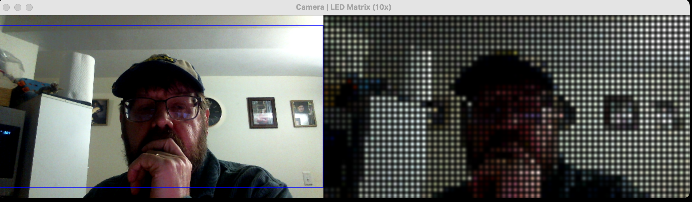
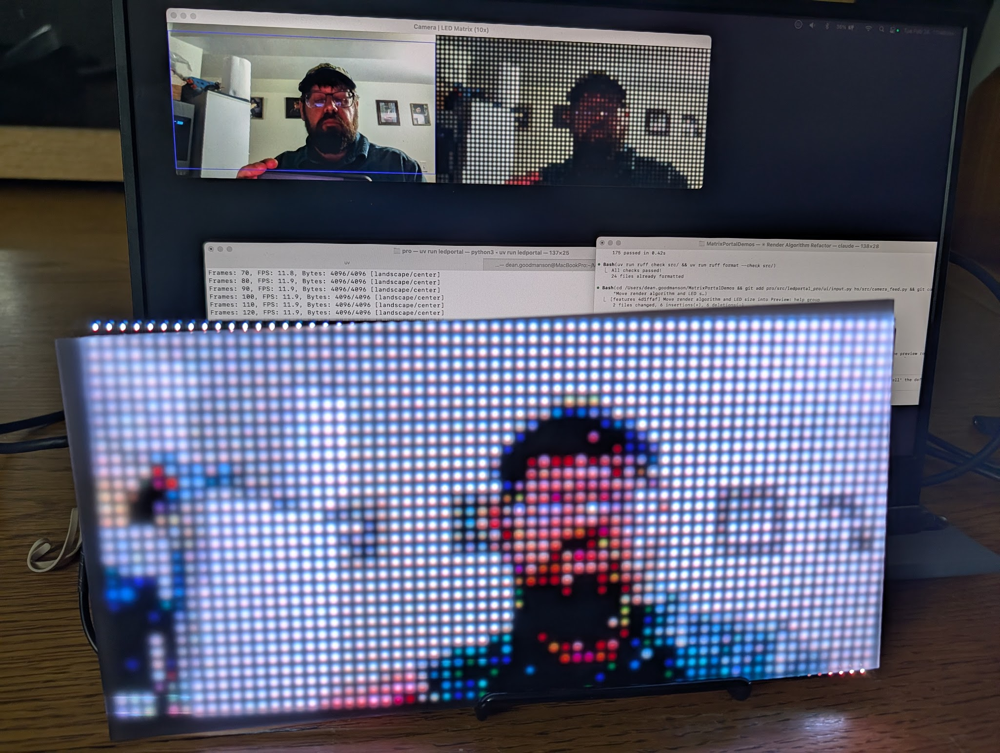

# LED Diffuser Panel Analysis

Measurement and calibration of the Gaussian blur render mode against real hardware photographs of the 64×32 RGB LED matrix, with and without diffuser panel.

---

## Reference Images

| File | Description |
|------|-------------|
| `hardware/matrixPixelsDiffused.jpg` | Close-up of white LEDs through diffuser; dense row (all neighbours lit) |
| `hardware/matrixPixelsGreenDiffused.jpg` | Green "15" display through diffuser; isolated LEDs with dark gaps |
| `hardware/matrixPixelsGreenRaw.jpg` | Green display without diffuser (reference) |

All images are 1162 × 1544 px. Cell pitch in the photos: **~140 px** (white diffused), **~180 px** (green diffused), **~102 px** (green raw).

---

## Model: Point-Source + Gaussian Blur

The `GAUSSIAN` render mode simulates a physical diffuser panel using the following model:

1. Place each LED's colour as a single pixel at its cell centre on an otherwise-black canvas.
2. Blur the canvas with a Gaussian kernel of standard deviation σ.
3. Normalise the result by multiplying by `2πσ²` to restore the peak brightness at each LED centre to the original value.

This matches the physical behaviour of a frosted diffuser, which spreads each point source of light as a Gaussian blob.

### Key parameter

```
σ = scale × 0.27
```

At the default preview scale of 10 px/cell: **σ = 2.7 px**.

This gives:
- **FWHM = 63.6% of cell width** (the diameter at half peak brightness)
- **Isolated LED gap/peak = 18%** (brightness midway between one lit LED and a dark neighbour)
- **Dense row gap/peak = 36%** (midway between two adjacent lit LEDs, both contributing)

---

## Measurement Methodology

### Cell pitch

Measured by autocorrelation of brightness profiles along rows and columns. The median across multiple scan lines was used to reduce noise.

### Gap/peak ratio

The **gap** is the minimum brightness in the midpoint region between a bright LED centre and the adjacent cell boundary (at ½ pitch distance). The **peak** is the maximum brightness at the LED centre.

Two conditions require different formulas:

| Condition | Formula |
|-----------|---------|
| Isolated LED (neighbours off) | `gap/peak = exp(−(pitch/2)² / 2σ²)` |
| Dense row (both neighbours lit) | `gap/peak = 2 × exp(−(pitch/2)² / 2σ²)` |

The dense-row value is exactly **2×** the isolated value because both the measured LED and its neighbour contribute equally at the midpoint.

### FWHM

The full-width at half-maximum of the brightness profile through a single LED centre. Measured as the pixel distance between the left and right half-maximum crossings.

Note: FWHM measured from a camera photograph includes the camera's own point spread function (PSF). These add in quadrature:

```
σ_measured² = σ_LED² + σ_camera²
```

For a close-up macro shot, the camera PSF contribution is roughly 10–20% of cell width.

---

## Results

### `matrixPixelsDiffused.jpg` — White LEDs, Dense Row

- **Cell pitch**: ~140 px
- **Condition**: All adjacent LEDs lit (dense horizontal text)
- **Measurement**: gap/peak ≈ **37%**
- **Model prediction** (σ = 0.27, dense row): **36%**
- **Result**: ✓ Match within 1 percentage point — primary calibration source

Brightness profile at half-pitch from a white LED centre:

```
Measured:   37%
Predicted:  36%   (2 × exp(−1 / (8 × 0.27²)))
```

This is the measurement that determined σ = 0.27.

---

### `matrixPixelsGreenDiffused.jpg` — Green LEDs, Isolated

- **Cell pitch**: ~180 px
- **Condition**: Isolated LEDs (dark neighbours on all four sides)
- **Isolated LEDs found**: 190 candidates; 10 cleanest used for averaging

#### Gap/peak (isolated)

| | Value |
|--|-------|
| Measured (background-subtracted) | ~9% |
| Camera background level | ~15–22 counts |
| Model prediction (isolated, σ = 0.27) | 18% |

The measured 9% is a **lower bound**: the gap falls to approximately the camera's ambient noise floor (~17 counts), so the true LED contribution at the midpoint is indistinguishable from background. The model's 18% prediction is consistent — it means the gap is nearly invisible, which matches visually (clear dark gaps between isolated green LEDs).

#### FWHM (isolated, average of 10 cleanest LEDs)

| | Value |
|--|-------|
| Measured FWHM | 150 px = **83% of cell** |
| Model prediction (LED only) | 63.6% of cell |
| Implied σ from raw FWHM | 35.4% of cell |
| Camera PSF estimate | 15–20% of cell |
| LED σ after deconvolution | **~29–33% of cell** |

Subtracting the camera PSF in quadrature:

| Camera PSF σ | Implied LED σ |
|---|---|
| 10% of cell | 33.9% |
| 15% of cell | 32.0% |
| 20% of cell | 29.2% |

All estimates bracket the implemented value of **27%**.

---

### `matrixPixelsGreenRaw.jpg` — Green LEDs, No Diffuser

- **Cell pitch**: ~102 px
- **Condition**: No diffuser panel; LED SMD packages directly visible
- **LED centres found**: 124 grid cells; 25–30 clean profiles averaged per axis

The raw LED profile has a distinctive **peaked core with a wide halo** — unlike the smooth Gaussian of the diffused case.

#### Diameter at each brightness threshold (averaged profile, background-subtracted)

The H (horizontal) and V (vertical) axes differ due to the photo being taken at a slight angle. V-axis measurements are more representative of the true physical diameter.

| Threshold | H diameter | H % cell | V diameter | V % cell |
|-----------|-----------|----------|-----------|----------|
| 90% power | 4 px | 3.9% | 2 px | 2.0% |
| 75% power | 15 px | 14.7% | 17 px | 16.7% |
| **50% power (FWHM)** | **35 px** | **34%** | **50 px** | **49%** |
| 25% power | 71 px | 70% | 86 px | 84% |
| 10% power | 110 px | 108% | 126 px | 124% |

#### Key observations

**1. The bright core is very tight.**
FWHM ≈ 34–49% of cell (H and V average ~42%). The equivalent Gaussian σ is **≈ 15–21% of cell** — roughly half the diffused value of 27%.

**2. The profile is not flat-topped.**
The brightness falls continuously from the centre — there is no plateau. This means a hard-edge circle will always over- or under-estimate the visible lit area depending on which threshold is chosen.

**3. The halo extends beyond the cell boundary.**
At the 10% power threshold, the glow spans 108–124% of cell pitch. This tail is a combination of camera lens bloom (the LEDs are very bright relative to the dark substrate) and green reflection off the PCB substrate material. It is not a meaningful physical boundary for the LED itself.

**4. The gap between adjacent LEDs is nearly zero.**
Background-subtracted gap/peak ≈ 6.6% — the midpoint between two adjacent raw LEDs (one on, one off) is almost entirely dark.

#### Physical interpretation

The raw LED consists of a small semiconductor die emitting light through an epoxy lens. The physical emitting area has FWHM ≈ 40–50% of the cell pitch (V-axis measurement, least affected by camera angle). The wide tail is camera bloom and substrate glow, not the physical LED boundary.

---

## Render Mode Recommendation for Raw LED Simulation

### The question: is a 25%-diameter circle mode appropriate?

A **25% diameter** circle (radius = 12.5% of cell) would only cover the very bright core above the 50% power threshold (FWHM ≈ 34–49%). At scale=10px, this would be a circle of radius 1.25px — a single-pixel dot. This is too small to be visually meaningful and would appear nearly identical to squares at normal scale.

### Comparison against existing circle modes

| Mode | Diameter | Matches threshold |
|------|----------|-------------------|
| CIRCLES_50 | 50% | ~50% power boundary (FWHM on V-axis) |
| CIRCLES_75 | 75% | ~25% power boundary |
| CIRCLES_100 | 100% | below 10% power boundary |

**CIRCLES_50 (50% diameter) is the best hard-circle approximation** for the raw LED appearance. Its diameter matches the measured FWHM on the V-axis (49%), meaning it represents the half-power boundary of the LED — the point up to which the LED is "more than half as bright as its centre". This is a natural perceptual threshold for "where the LED is".

### Is a new render mode needed?

A hard-edge circle of any size cannot fully capture the raw LED profile because:

1. The profile is continuous (no flat top)
2. The 50% boundary (FWHM) is well matched by CIRCLES_50
3. The 25% boundary (visible glow edge) falls at 70–84% of cell — between CIRCLES_75 and CIRCLES_100 — and varies by axis

For a **physically accurate** simulation of the raw LED including its gradual fall-off, a new Gaussian mode with a narrower σ would be appropriate:

| Mode | σ | Represents |
|------|---|-----------|
| `GAUSSIAN` (existing) | 27% of cell | With diffuser panel |
| `GAUSSIAN_RAW` (proposed) | **15–21% of cell** | Without diffuser panel |

The proposed σ range (15–21%) brackets the measurement: σ from FWHM on H-axis = 14.6%, on V-axis = 21.2%, average **~18%**. A round value of **σ = 0.18 × cell** would accurately simulate the raw LED appearance.

### Verdict

| Approach | Verdict | Notes |
|----------|---------|-------|
| New CIRCLES_25 (25% diameter) | ✗ Too small | Dots would be 1–2px at scale=10; indistinguishable from squares |
| Existing CIRCLES_50 | ✓ Good approximation | Matches FWHM (50% power boundary) of real LED |
| New GAUSSIAN_RAW (σ ≈ 0.18) | ✓ Best accuracy | Captures gradual fall-off; would need adding to all three versions |

**Recommendation: no new mode is strictly required.** CIRCLES_50 is a visually reasonable approximation of the raw LED. If physical accuracy matters, a `GAUSSIAN_RAW` mode with σ = 0.18 × cell would be the correct addition — not a 25% hard-edge circle.

---

## Summary

Both diffused photos are consistent with **σ = 0.27 × cell_width**:

### Diffused (σ = 0.27)

| Source | Condition | Measured | Predicted | Verdict |
|--------|-----------|----------|-----------|---------|
| `matrixPixelsDiffused.jpg` | Dense row (white) | gap/peak = 37% | 36% | ✓ |
| `matrixPixelsGreenDiffused.jpg` | Isolated (green) | gap at noise floor (≤9%) | 18% → near-zero | ✓ |
| `matrixPixelsGreenDiffused.jpg` | FWHM (green) | 83% (camera-broadened) | 63.6% + camera PSF | ✓ |

The primary calibration is the dense-row measurement (37% ≈ 36%), which directly determines σ. The isolated LED measurement provides independent confirmation: the gap falls below the camera noise floor, which is exactly what the model predicts for σ = 0.27 (only 18% of peak remains at the midpoint — low enough to be hidden by ambient light in the photo).

### Raw / no diffuser

| Source | Measurement | Value |
|--------|-------------|-------|
| `matrixPixelsGreenRaw.jpg` | FWHM (50% power diameter) | 34% (H) – 49% (V); avg ~42% of cell |
| `matrixPixelsGreenRaw.jpg` | Equivalent σ | 15% (H) – 21% (V); avg ~18% of cell |
| `matrixPixelsGreenRaw.jpg` | Gap/peak (bg-subtracted) | ~7% — nearly dark between LEDs |
| `matrixPixelsGreenRaw.jpg` | 10% power diameter | >100% of cell (camera bloom + substrate) |

Best existing mode match: **CIRCLES_50** (50% diameter ≈ V-axis FWHM).
Full-accuracy simulation would require a new `GAUSSIAN_RAW` mode with σ ≈ **0.18 × cell**.

---

## Implementation

The calibrated σ = 0.27 is used identically across all three project versions:

| Version | File | Method |
|---------|------|--------|
| `pro/` | `src/ledportal_pro/ui/overlay.py` | `cv2.GaussianBlur` on float32 point-source canvas + `2πσ²` peak normalisation |
| `hs/` | `src/camera_feed.py` | Same `cv2.GaussianBlur` approach with educational comments |
| `utils/` | `src/ledportal_utils/snapshot.py` | Gaussian-weighted accumulator (no OpenCV; PIL/NumPy only) |

### Pro / HS implementation sketch

```python
sigma = scale * 0.27          # σ in output pixels (e.g. 2.7 px at scale=10)

# 1. Place each LED as a point source on a black canvas
dots = np.zeros((out_h, out_w, 3), dtype=np.float32)
for row, col in each_led:
    cy, cx = row * scale + scale // 2, col * scale + scale // 2
    dots[cy, cx] = pixel_color

# 2. Blur to spread each point source as a Gaussian blob
blurred = cv2.GaussianBlur(dots, (0, 0), sigma)

# 3. Normalise: restore peak brightness to original value
peak_factor = 2.0 * math.pi * sigma * sigma
result = np.clip(blurred * peak_factor, 0, 255).astype(np.uint8)
```

### Utils implementation sketch (PIL/NumPy, no cv2)

```python
# Pre-build Gaussian kernel with radius = ceil(3σ)
r = math.ceil(3 * sigma)
local_ys = np.arange(2*r+1, dtype=np.float32) - r
local_xs = np.arange(2*r+1, dtype=np.float32) - r
ldx, ldy = np.meshgrid(local_xs, local_ys)
gauss_kernel = np.exp(-(ldx**2 + ldy**2) / (2 * sigma**2))

# Accumulate each LED's weighted contribution
accumulator = np.zeros((out_h, out_w, 3), dtype=np.float32)
for each_led:
    # bounding-box slice centred on this LED's output position
    accumulator[y1:y2, x1:x2] += gauss_kernel_slice * led_color

result = np.clip(accumulator, 0, 255).astype(np.uint8)
```

The accumulator peak weight is 1.0 (kernel centre = `exp(0) = 1`), so no separate normalisation step is needed.

---

## Preview Brightness vs. Physical LED Brightness

### Observation

The software preview renders LED colours using the raw RGB values from the camera, but the physical LED matrix appears dramatically brighter than the preview at the same RGB values.



The preview (right panel above) shows a tonally rich, moderately bright image. The physical matrix (below) at the same pixel values is much brighter, with highlights approaching white and reduced apparent contrast.



### Why this happens

A monitor and an RGB LED matrix both receive the same 8-bit RGB values, but they differ fundamentally in how those values map to emitted light:

- **Monitor**: sRGB-encoded values are gamma-expanded and displayed at typical peak luminance of ~100–500 cd/m². The panel's backlight or OLED emitters are calibrated to a standardised colour space.
- **LED matrix**: Each LED's forward current is set proportionally to the 8-bit value with no gamma correction. The physical luminance of the LEDs at full drive (255) is significantly higher than a monitor's white point, and the relationship between value and perceived brightness is closer to linear than the gamma-corrected sRGB curve.

The result: an RGB value of (128, 128, 128) — perceptually mid-grey on a monitor — drives each LED to 50% current, which on a high-brightness panel reads as visibly bright rather than mid-grey.

### Implications for the preview

The current preview is **spatially accurate** (Gaussian diffusion model matches hardware) but **tonally too dark** relative to what a viewer sees when looking at the physical panel. The preview gives a correct representation of which LEDs are lit and their relative colours, but understates the perceived luminance of the panel.

Potential approaches to close the gap:

| Approach | Description |
|----------|-------------|
| Gamma correction | Apply inverse sRGB gamma (γ ≈ 2.2) to preview pixels before display — brightens midtones to approximate linear LED output |
| Brightness scale | Multiply preview RGB values by a fixed factor (e.g. 1.5–2×), clipping at 255 — simple but clips highlights |
| Tonemapping | Compress the dynamic range of the preview to simulate the panel's high-luminance output on a lower-luminance screen |
