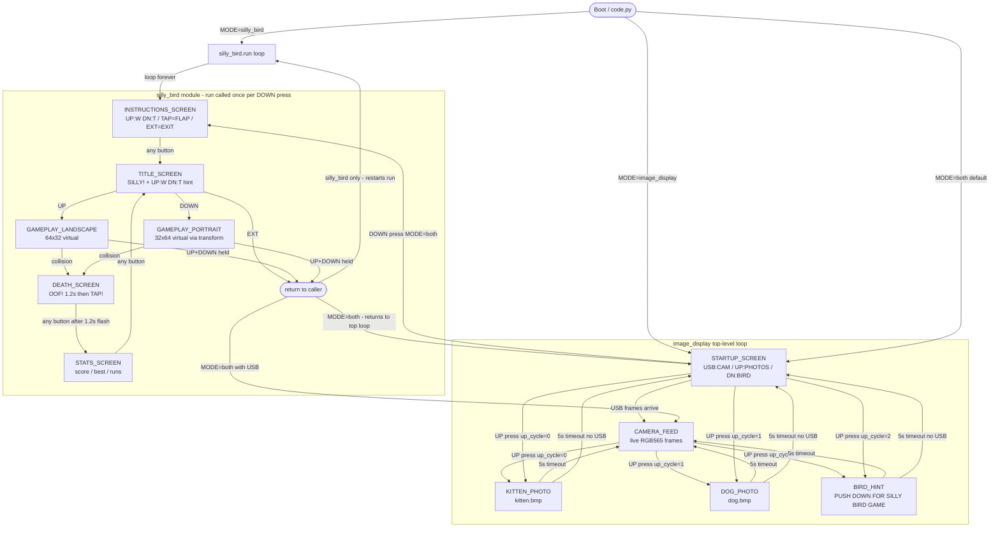
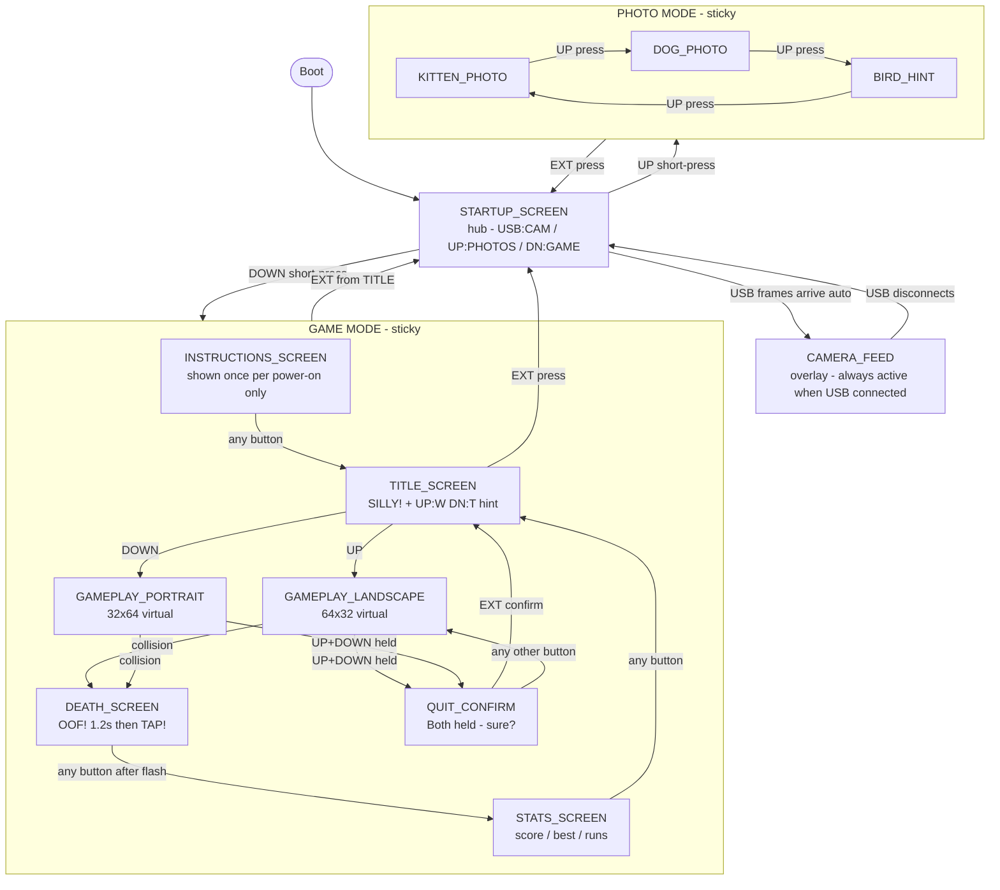

# Matrix Portal Navigation Reference

Hardware: Adafruit Matrix Portal M4/S3, 64×32 RGB LED matrix  
Buttons: UP (board.BUTTON_UP), DOWN (board.BUTTON_DOWN), EXT (A0 external momentary)

---

## Section 1: Screen Inventory

| Screen Name | Description | Entry Trigger | Exit Trigger(s) |
|---|---|---|---|
| STARTUP_SCREEN | 3-row idle guide: "USB:CAM / UP:PHOTOS / DN:BIRD" | Boot, or return from any sub-mode | USB frame arrives (→ CAMERA_FEED); UP press (→ photo cycle); DOWN press (→ GAME_MODE, `both` only) |
| CAMERA_FEED | Live RGB565 frame stream rendered to bitmap | First frame received over USB CDC serial | USB host disconnects (falls back to STARTUP_SCREEN on next UP/DOWN event) |
| KITTEN_PHOTO | kitten.bmp displayed full-screen | UP short-press (up_cycle == 0) | 5 s timeout (auto-returns to CAMERA_FEED or STARTUP_SCREEN) |
| DOG_PHOTO | dog.bmp displayed full-screen | UP short-press (up_cycle == 1) | 5 s timeout (auto-returns to CAMERA_FEED or STARTUP_SCREEN) |
| BIRD_HINT | "PUSH DOWN / FOR SILLY / BIRD GAME" text | UP short-press (up_cycle == 2) | 5 s timeout (auto-returns to CAMERA_FEED or STARTUP_SCREEN) |
| INSTRUCTIONS_SCREEN | "UP:W DN:T / TAP=FLAP / EXT=EXIT" help text | First entry to `silly_bird.run()` each call | Any button press |
| TITLE_SCREEN | Game title "SILLY!" with "UP:W DN:T" mode-select hint | After INSTRUCTIONS_SCREEN, and after each STATS_SCREEN | UP (start landscape game); DOWN (start portrait game); EXT (exit `run()`) |
| GAMEPLAY_LANDSCAPE | Active game, landscape orientation (64×32 virtual) | UP on TITLE_SCREEN | Bird hits pipe or ground (→ DEATH_SCREEN); both UP+DOWN held (→ silent quit) |
| GAMEPLAY_PORTRAIT | Active game, portrait orientation (32×64 virtual via 90° CW transform) | DOWN on TITLE_SCREEN | Bird hits pipe or ground (→ DEATH_SCREEN); both UP+DOWN held (→ silent quit) |
| DEATH_SCREEN | Black screen with "OOF!" label for 1.2 s, then "TAP!" waiting for input | Collision detected in game loop | Any button press (after the 1.2 s flash) |
| STATS_SCREEN | Score / best / runs summary; any button continues | After "TAP!" is dismissed on DEATH_SCREEN | Any button press (→ TITLE_SCREEN) |

---

## Section 2: Current Navigation

**Current navigation problems visible in this diagram:**

- INSTRUCTIONS_SCREEN appears on every DOWN press in `both` mode, not once per power-on.
- Photo screens (KITTEN, DOG, HINT) exit only via 5 s timeout — no button dismiss.
- EXT on TITLE_SCREEN exits `silly_bird.run()` entirely, forcing a DOWN press to re-enter game mode.
- Both-buttons-held quits the game silently with no confirmation or stats update.
- There is no "photo mode" concept — photos are one-shot interruptions that self-dismiss.

---

## Section 3: Proposed Navigation (sticky modes)

**Key changes from current to proposed:**

- STARTUP_SCREEN is the explicit hub; all modes return here via EXT.
- UP press enters PHOTO_MODE and stays there; photos cycle UP→UP→UP, no timeouts.
- DOWN press enters GAME_MODE and stays there; EXT on TITLE_SCREEN is the only way out.
- INSTRUCTIONS_SCREEN is gated by a module-level `_instructions_shown` flag, shown once per power-on.
- Both-buttons-held in gameplay goes to QUIT_CONFIRM instead of silently quitting; EXT confirms, any other button resumes.
- CAMERA_FEED is a passive overlay that activates whenever USB frames arrive, regardless of mode.

---

## Section 4: Implementation Notes

**`image_display.py`**

- `show_kitten()`, `show_dog()`, `show_bird_hint()`: Remove the `time.sleep(5)` calls. Add a button-poll loop identical to `_show_instructions()` in `silly_bird.py`; dismiss on any button press or EXT. Return a value indicating which button was pressed so the caller can route to STARTUP on EXT.

**`silly_bird.py`**

- Add a module-level boolean `_instructions_shown = False`. In `run()`, only call `_show_instructions()` when `_instructions_shown` is `False`, then set it `True`. This makes instructions appear once per power-on regardless of how many times `run()` is called.
- Add `_show_quit_confirm(display, ...)` function: brief "QUIT?" screen, EXT confirms (returns to title loop), any other button resumes gameplay. Replace the `if not button_up.value and not button_down.value: quit_game = True; break` block with a call to this function.
- Change `quit_game` path: instead of `return` (which exits to the caller), loop back to `TITLE_SCREEN`. Only `EXT on TITLE_SCREEN` should `return`.

**`code.py` — `both` mode loop**

- Introduce a `current_mode` variable (`"camera"`, `"photo"`, `"game"`). Replace the flat `if button_up.fell / if button_down.fell` checks with a small state machine.
- `current_mode = "photo"` on UP press: call photo functions in a loop, cycling on each UP press, returning to `current_mode = "camera"` (or `"startup"`) only on EXT.
- `current_mode = "game"` on DOWN press: call `silly_bird.run()` once; since `run()` now loops internally until EXT-on-title, it returns only when the player explicitly exits, then set `current_mode = "camera"` (or `"startup"`).
- Remove the `up_cycle` counter from `code.py`; move photo-cycle state into a dedicated helper or into `image_display.py` so `code.py` just calls `image_display.run_photo_mode(display, buttons...)`.
- `silly_bird` and `image_display` modes in `code.py` (non-`both`) are unaffected — they already loop forever at the top level.

**`settings.toml`** — no changes required; sticky-mode behaviour is purely firmware logic.
