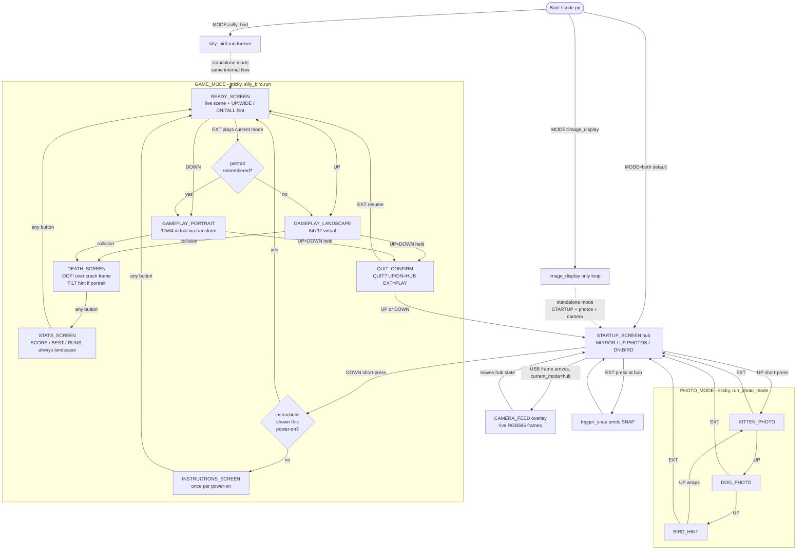

# Matrix Portal Navigation Reference

Hardware: Adafruit Matrix Portal M4/S3, 64×32 RGB LED matrix
Buttons: UP (board.BUTTON_UP), DOWN (board.BUTTON_DOWN), EXT (A0 external momentary clicker)

---

## Section 1: Screen Inventory

| Screen Name | Description | Entry Trigger | Exit Trigger(s) |
|---|---|---|---|
| STARTUP_SCREEN | Hub: 3 rows — `MIRROR` blue (auto when USB connects), `UP:PHOTOS` light blue, `DN:BIRD` yellow | Boot, or return from any sticky mode | USB frame arrives (→ CAMERA_FEED overlay); UP press (→ PHOTO_MODE); DOWN press (→ GAME_MODE, `both` only); EXT press (→ snapshot trigger) |
| CAMERA_FEED | Live RGB565 frame stream rendered into the camera bitmap | First USB frame received while `current_mode == "hub"` | Mode switches away from hub (game/photo own the display); resumes automatically when control returns to the hub if frames are still arriving |
| KITTEN_PHOTO | `kitten.bmp` displayed full-screen | Enter PHOTO_MODE (first photo shown) | UP (→ DOG_PHOTO); EXT (→ STARTUP_SCREEN) |
| DOG_PHOTO | `dog.bmp` displayed full-screen | UP from KITTEN_PHOTO | UP (→ BIRD_HINT); EXT (→ STARTUP_SCREEN) |
| BIRD_HINT | Three-line "PUSH DOWN / FOR SILLY / BIRD GAME" teaser | UP from DOG_PHOTO | UP (→ KITTEN_PHOTO, wraps); EXT (→ STARTUP_SCREEN) |
| INSTRUCTIONS_SCREEN | "WIDE/TALL / TAP=FLAP / EXT=PLAY" controls cheat-sheet | First entry to `silly_bird.run()` per power-on (`_instructions_shown` flag) | Any button press (→ READY_SCREEN) |
| READY_SCREEN | Live game scene with bird parked mid-screen; two-line bottom hint "UP:WIDE" (bright if landscape selected, dim otherwise) and "DN:TALL" (bright if portrait selected, dim otherwise) | After INSTRUCTIONS_SCREEN, after STATS_SCREEN, after QUIT_CONFIRM resume | UP (start landscape round); DOWN (start portrait round); EXT (start round in currently-selected mode); `silly_bird.run` returns to caller is NOT triggered here — exit is via QUIT_CONFIRM only |
| GAMEPLAY_LANDSCAPE | Active round, 64×32 virtual = physical | UP on READY_SCREEN, or EXT when landscape is selected | Collision (→ DEATH_SCREEN); UP+DOWN both held (→ QUIT_CONFIRM) |
| GAMEPLAY_PORTRAIT | Active round, 32×64 virtual via 90° CW transform; hold device tall, USB at bottom | DOWN on READY_SCREEN, or EXT when portrait is selected | Collision (→ DEATH_SCREEN); UP+DOWN both held (→ QUIT_CONFIRM) |
| QUIT_CONFIRM | "QUIT? / UP/DN=HUB / EXT=PLAY" | UP+DOWN both held during gameplay | UP or DOWN (→ STARTUP_SCREEN, exits game mode); EXT (→ READY_SCREEN, resumes) |
| DEATH_SCREEN | Crash frame frozen; red "OOF!" label overlaid in landscape coords; grey "TILT" hint added if the round was portrait | Collision detected during gameplay | Any button press (→ STATS_SCREEN) |
| STATS_SCREEN | Always landscape; "NEW BEST!" or "- STATS -" header plus `SCORE`, `BEST`, `RUNS` rows at y=5/12/19/26 | After DEATH_SCREEN is dismissed | Any button press (→ READY_SCREEN) |

---

## Section 2: Implemented Navigation

Key navigation rules:

- STARTUP_SCREEN is the hub; every sticky mode returns here via EXT (or UP/DN from QUIT_CONFIRM).
- UP from hub enters PHOTO_MODE and stays there; UP cycles `kitten → dog → bird hint → kitten`; EXT returns to hub.
- DOWN from hub enters GAME_MODE and stays there; the only exit is QUIT_CONFIRM answered with UP or DOWN.
- CAMERA_FEED is a passive overlay: it activates automatically whenever USB frames arrive AND `current_mode == "hub"`. Photo/game modes own the display while active.
- INSTRUCTIONS_SCREEN is gated by a module-level `_instructions_shown` flag, so it appears once per power-on regardless of how many times the player re-enters the game.
- The chosen orientation is remembered across rounds; READY_SCREEN highlights the currently-selected mode and EXT replays it.
- Post-game screens (DEATH_SCREEN, STATS_SCREEN) always render in landscape coords; a grey "TILT" hint on DEATH_SCREEN tells the player to rotate the device after a portrait round.
- The EXT clicker is never a dead-end: EXT on READY_SCREEN starts a round, EXT on QUIT_CONFIRM resumes play, EXT on any photo returns to the hub.

---

## Section 3: Proposal Status

Section 3 proposal fully implemented — see Section 2.

---

## Section 4: Implementation

Implementation complete. The sticky-mode navigation, single-shot instructions, QUIT_CONFIRM flow, READY_SCREEN with live mode hints, landscape-locked post-game screens, and clicker-safe EXT routing all landed in commits `d3b3608..975d352` on this branch.
