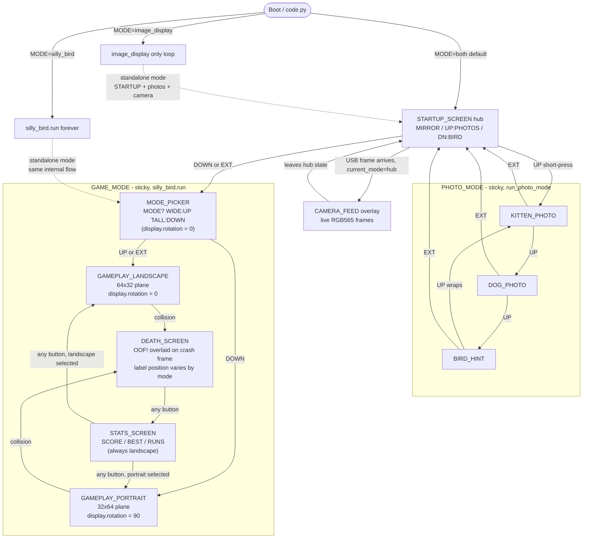

# Matrix Portal Navigation Reference

Hardware: Adafruit Matrix Portal M4/S3, 64×32 RGB LED matrix
Buttons: UP (board.BUTTON_UP), DOWN (board.BUTTON_DOWN), EXT (A0 external momentary clicker)

---

## Section 1: Screen Inventory

| Screen Name | Description | Entry Trigger | Exit Trigger(s) |
|---|---|---|---|
| STARTUP_SCREEN | Hub: 3 rows — `MIRROR` blue (auto when USB connects), `UP:PHOTOS` light blue, `DN:BIRD` yellow | Boot, or return from PHOTO_MODE | USB frame arrives (→ CAMERA_FEED overlay); UP press (→ PHOTO_MODE); DOWN or EXT press (→ MODE_PICKER) |
| CAMERA_FEED | Live RGB565 frame stream rendered into the camera bitmap | First USB frame received while `current_mode == "hub"` | Mode switches away from hub (game/photo own the display); resumes automatically when control returns to the hub if frames are still arriving |
| KITTEN_PHOTO | `kitten.bmp` displayed full-screen | UP from STARTUP_SCREEN (first photo) | UP (→ DOG_PHOTO); EXT (→ STARTUP_SCREEN) |
| DOG_PHOTO | `dog.bmp` displayed full-screen | UP from KITTEN_PHOTO | UP (→ BIRD_HINT); EXT (→ STARTUP_SCREEN) |
| BIRD_HINT | Three-line "PUSH DOWN / FOR SILLY / BIRD GAME" teaser | UP from DOG_PHOTO | UP (→ KITTEN_PHOTO, wraps); EXT (→ STARTUP_SCREEN) |
| MODE_PICKER | "MODE? / WIDE: UP / TALL: DOWN" orientation picker. Always rendered in landscape (`display.rotation = 0`). | First (and only) screen on entry to `silly_bird.run()` | UP or EXT (→ GAMEPLAY_LANDSCAPE); DOWN (→ GAMEPLAY_PORTRAIT) |
| GAMEPLAY_LANDSCAPE | Active round, 64×32 plane. `display.rotation = 0`. | UP/EXT on MODE_PICKER, or auto-restart after STATS_SCREEN if landscape selected | Collision (→ DEATH_SCREEN). No in-game exit to hub — RESET is the only way out. |
| GAMEPLAY_PORTRAIT | Active round, 32×64 plane. `display.rotation = 90` so labels and bitmap are upright with USB at bottom. | DOWN on MODE_PICKER, or auto-restart after STATS_SCREEN if portrait selected | Collision (→ DEATH_SCREEN). No in-game exit to hub — RESET is the only way out. |
| DEATH_SCREEN | Red "OOF!" label overlaid on the crash frame, positioned for the current orientation (label stays upright via `display.rotation`). | Collision detected during gameplay | Any button press (→ STATS_SCREEN) |
| STATS_SCREEN | Always landscape (`start_round(display, False)` resets rotation). "NEW BEST!" or "- STATS -" header plus `SCORE`, `BEST`, `RUNS` rows. | After DEATH_SCREEN is dismissed | Any button press (→ next GAMEPLAY round in the same mode) |

---

## Section 2: Implemented Navigation

Key navigation rules:

- STARTUP_SCREEN is the hub for `MODE=both`; PHOTO_MODE returns here on EXT, but GAME_MODE never does — RESET is the only way out of the game once entered.
- UP from hub enters PHOTO_MODE; UP cycles `kitten → dog → bird hint → kitten`; EXT returns to hub.
- DOWN or EXT from hub enters GAME_MODE; the MODE_PICKER is shown once per entry and remembers the choice for the rest of the session.
- CAMERA_FEED is a passive overlay: it activates automatically whenever USB frames arrive AND `current_mode == "hub"`. Photo/game modes own the display while active.
- Orientation is chosen once on the MODE_PICKER and reused for every subsequent round. To change orientation mid-session, press the RESET button on the device and re-enter game mode.
- Portrait support uses `display.rotation = 90` — labels and bitmap rotate together, so OOF! and the score read upright when the device is held tall.
- STATS_SCREEN is always landscape (forces `display.rotation = 0`); the player rotates back to landscape after a portrait round to read it, then the next round restores their chosen rotation.

---

## Section 3: History

Earlier iterations of game mode included an INSTRUCTIONS_SCREEN gated by a "once per power-on" flag, a READY_SCREEN with live UP:WIDE / DN:TALL hints, and a QUIT_CONFIRM screen reached by holding UP+DOWN. All three were removed in favor of the simpler MODE_PICKER → game → stats loop and RESET-only exit. The TILT hint on DEATH_SCREEN was also removed once `display.rotation` made portrait labels render upright on their own.
